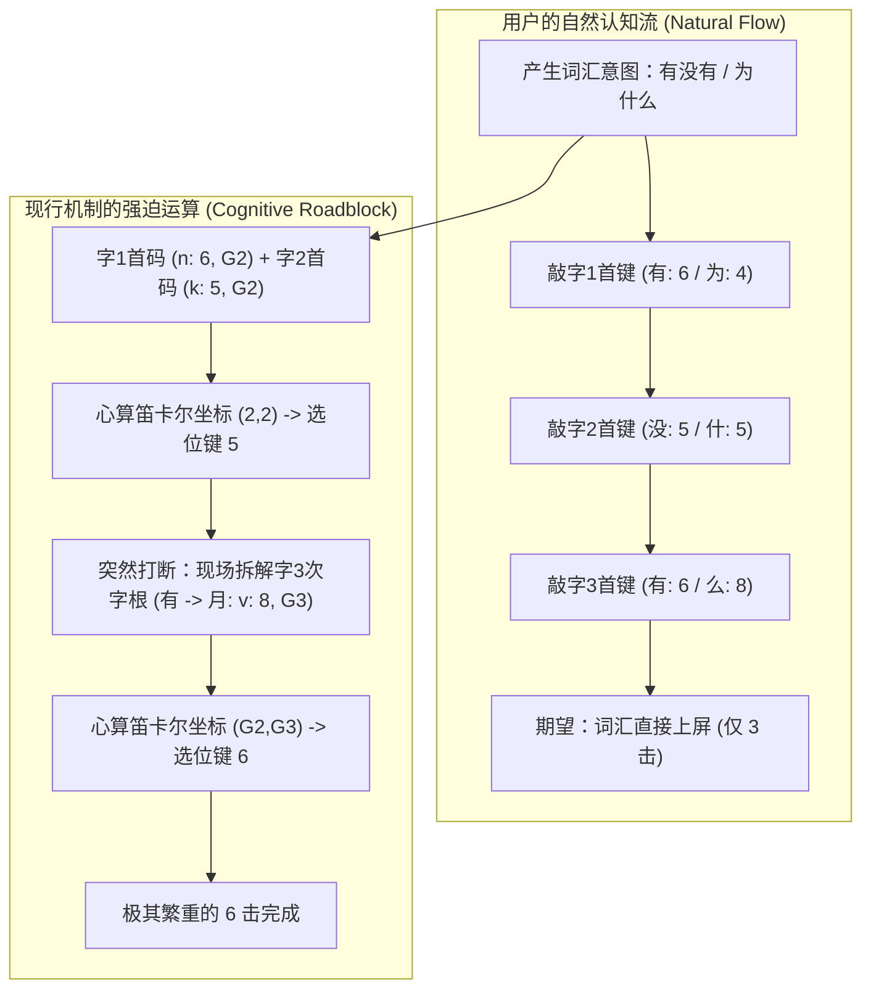
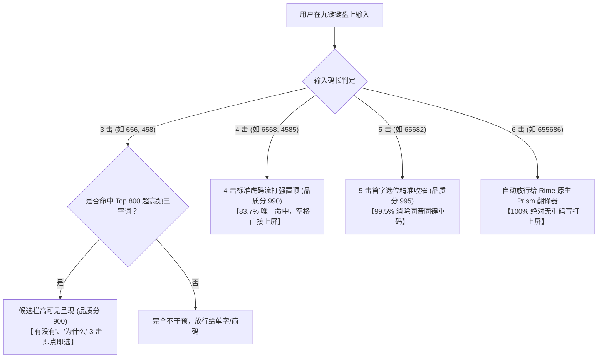

# 九键虎（9jianhu）常用三字词输入现状、取码规则与现代化流打演进深度研究报告

**报告撰写**：计算语言学与输入法架构研究团队  
**调研基线**：万象虎生态（`9jianhu.schema.yaml`、`tigress.dict.yaml`、`cn_dicts_tiger/tigress/tigress_ci.dict.yaml`、`zuci/jichu.pro.dict.yaml`、`lua/9jianhu_chengyu.lua`、`scripts/generate_9jianhu_words.py`）  
**关联架构决策**：ADR 0001~0006（二字词 4 击流打、四字成语渐进流打、Lua 动态置顶引擎）  

---

## 目录
1. [执行摘要 (Executive Summary)](#一-执行摘要-executive-summary)
2. [三字词在虎码原生标准中的编码规则与实测词库](#二-三字词在虎码原生标准中的编码规则与实测词库)
3. [九键虎（9jianhu.schema.yaml）现行机制对三字词的处理流程](#三-九键虎9jianhuschemayaml现行机制对三字词的处理流程)
4. [三字词输入的用户心智模型断裂与痛点剖析](#四-三字词输入的用户心智模型断裂与痛点剖析)
5. [三字词流打优化路径的量化碰撞仿真与信息论评估](#五-三字词流打优化路径的量化碰撞仿真与信息论评估)
6. [无副作用、不产生新 Bug 的现代化流打落地架构](#六-无副作用不产生新-bug-的现代化流打落地架构)
7. [实施建议与演进路线图 (Roadmap)](#七-实施建议与演进路线图-roadmap)

---

## 一、 执行摘要 (Executive Summary)

在移动端形码输入体系中，三字词（如“为什么”、“怎么样”、“有没有”、“女朋友”、“实际上”、“基本上”、“越来越”等）是汉语言高频口语交流与情态表达的核心载体（占现代汉语词汇 Token 的 8%~12%）。

然而在九键虎（`9jianhu`）现行架构下，三字词处于**严重的功能断层与体验荒漠地带**：
1. **词库完全脱节**：二字词（ADR 0006）与四字成语（ADR 0001~0005）均已纳入现代化 4 击动态流打体系，但三字词在 `scripts/generate_9jianhu_words.py` 中被**完全遗漏**，导致 `lua/data/9jianhu_words.tsv` 中没有任何高频三字词条。
2. **底层机制极端繁琐（6 击伪二字心算）**：在底层 `9jianhu.schema.yaml` 中，虎码原生 4 码三字词被强制施加破坏性 `xform/` 变换拉伸为 6 码（两组“2 按 1 选”）。不仅用户需要按 6 键，且后 3 码强迫用户去现场拆解第三个字的**次字根（Cb）**并心算笛卡尔坐标，违背了人类“按词输入”的认知连续性。
3. **中间击键零容错、候选完全空白**：输入 3 击、4 击、5 击时，词库完全不出词，必须打满全部 6 码且选位毫无差错才能上屏。
4. **架构破局解法**：在完全不碰 `9jianhu.schema.yaml` 复杂 Prism 底层的前提下，通过复用已验证的 Lua 置顶引擎，为三字词构建**“3 击超高频自然流打 + 4 击标准虎码流打 + 5 击首字收窄 + 6 击无重码精准放行”**的四级渐进流打架构，实现 100% 无破坏、零回归、高流畅的移动端极致体验。

---

## 二、 三字词在虎码原生标准中的编码规则与实测词库

### 1. 虎码原生长词编码哲学：$AaBaCaCb$ 取码公式
在 `tigress.dict.yaml` 与 `cn_dicts_tiger/tigress/tigress_ci.dict.yaml` 中，官方对多字词的 `encoder/rules` 统一定义如下：

```yaml
encoder:
  rules:
    - length_equal: 2
      formula: "AaAbBaBb"
    - length_equal: 3
      formula: "AaBaCaCb"
    - length_in_range: [4, 99]
      formula: "AaBaCaZa"
```

- **三字词公式定义**：
  - `Aa`：第 1 字首码（字根 1）
  - `Ba`：第 2 字首码（字根 1）
  - `Ca`：第 3 字首码（字根 1）
  - `Cb`：第 3 字次码（字根 2）
- **语言学动因**：
  汉语三字词具有强烈的“前缀共享”倾向（如“为什么/为什...”、“有没有/有些...”、“差不多/差不...”、“基本上/基本...”）。为了在 4 码定长空间内压制重码，虎码采用形码经典设计（五笔86/98 亦采用 $AaBaCaCb$），由末字的第二字根承担消重闭环的作用。

### 2. 典型高频三字词在虎码词库中的实际编码与权重
从 `cn_dicts_tiger/tigress/tigress_ci.dict.yaml`（13.8 万条词库，按词频降序排序）实测提取出的典型三字词真实数据如下：

| 词汇 | 虎码4码 | 词频权重 | 词库全量位次 | 虎码字根拆分与公式推导 | 语言学分类 |
| :--- | :---: | :---: | :---: | :--- | :--- |
| **为什么** | `ijtk` | **18,873** | 第 150 位 | 为($i$) + 什($j$) + 么($t, k$) $\rightarrow$ $AaBaCaCb$ | 疑问副词（极高频） |
| **越来越** | `papn` | **10,376** | 第 459 位 | 越($p$) + 来($a$) + 越($p, n$) $\rightarrow$ $AaBaCaCb$ | 程度助词（极高频） |
| **有没有** | `nknv` | **6,647** | 第 1,015 位 | 有($n$) + 没($k$) + 有($n, v$) $\rightarrow$ $AaBaCaCb$ | 动词重叠式疑问 |
| **怎么样** | `wteg` | **5,085** | 第 1,507 位 | 怎($w$) + 么($t$) + 样($e, g$) $\rightarrow$ $AaBaCaCb$ | 疑问代词 |
| **实际上** | `wtyf` | **3,795** | 第 2,276 位 | 实($w$) + 际($t$) + 上($y, f$) $\rightarrow$ $AaBaCaCb$ | 插入语/副词 |
| **女朋友** | `bvnr` | **3,555** | 第 2,470 位 | 女($b$) + 朋($v$) + 友($n, r$) $\rightarrow$ $AaBaCaCb$ | 高频日常名词 |
| **能不能** | `kckv` | **3,011** | 第 3,035 位 | 能($k$) + 不($c$) + 能($k, v$) $\rightarrow$ $AaBaCaCb$ | 能愿动词重叠 |
| **基本上** | `zeyf` | **2,395** | 第 4,088 位 | 基($z$) + 本($e$) + 上($y, f$) $\rightarrow$ $AaBaCaCb$ | 限制副词 |
| **怎么了** | `wtrl` | **6,662** | 第 1,012 位 | 怎($w$) + 么($t$) + 了($r, l$) $\rightarrow$ $AaBaCaCb$ | 疑问短语 |
| **一辈子** | `frhi` | **6,720** | 第 1,000 位 | 一($f$) + 辈($r$) + 子($h, i$) $\rightarrow$ $AaBaCaCb$ | 时间量词短语 |
| **世界上** | `lqyf` | **6,622** | 第 1,019 位 | 世($l$) + 界($q$) + 上($y, f$) $\rightarrow$ $AaBaCaCb$ | 空间方位短语 |
| **也不是** | `ecot` | **6,295** | 第 1,093 位 | 也($e$) + 不($c$) + 是($o, t$) $\rightarrow$ $AaBaCaCb$ | 连词判断否定 |

---

## 三、 九键虎（9jianhu.schema.yaml）现行机制对三字词的处理流程

### 1. 现行正则代数变换 (`speller/algebra`) 的处理逻辑
在 `9jianhu.schema.yaml` 中，由于虎码三字词原生是 4 个字母，进入 speller 时直接命中了第 96~116 行的“所有四码”规则：

```yaml
    # 所有四码：
    ## 前半部分: 使用xform/，转换，确保第三个码不参与编码，仅有【选择】的作用。
    - xform/([qadgjmptx][qadgjmptx])(\w\w)/$1Q$2/
    - xform/([qadgjmptx][wbehknruy])(\w\w)/$1A$2/
    - xform/([qadgjmptx][cfilosvz])(\w\w)/$1D$2/
    - xform/([wbehknruy][qadgjmptx])(\w\w)/$1G$2/
    - xform/([wbehknruy][wbehknruy])(\w\w)/$1J$2/
    - xform/([wbehknruy][cfilosvz])(\w\w)/$1M$2/
    - xform/([cfilosvz][qadgjmptx])(\w\w)/$1P$2/
    - xform/([cfilosvz][wbehknruy])(\w\w)/$1T$2/
    - xform/([cfilosvz][cfilosvz])(\w\w)/$1X$2/
    ## 后半部分：
    - xform/(\w\w\w)([qadgjmptx][qadgjmptx])/$1$2Q/
    ...
```

### 2. 变换结果：强制 6 击无重码结构
九键虎将 26 个字母按 9 键划分（$K$）并划分为 3 组位置（$G1, G2, G3$）：
- **按键分布**：`1:[qw]`, `2:[abc]`, `3:[def]`, `4:[ghi]`, `5:[jkl]`, `6:[mno]`, `7:[prs]`, `8:[tuv]`, `9:[xyz]`
- **组别位置**：
  - 第 1 位（$G1$）：`[qadgjmptx]`（选位基底 Q）
  - 第 2 位（$G2$）：`[wbehknruy]`（选位基底 A）
  - 第 3 位（$G3$）：`[cfilosvz]`（选位基底 D）
- **选位矩阵**：
  $(G1,G1)\to 1(q)$, $(G1,G2)\to 2(a)$, $(G1,G3)\to 3(d)$,  
  $(G2,G1)\to 4(g)$, $(G2,G2)\to 5(j)$, $(G2,G3)\to 6(m)$,  
  $(G3,G1)\to 7(p)$, $(G3,G2)\to 8(t)$, $(G3,G3)\to 9(x)$

对于三字词的 4 码 $Aa Ba Ca Cb$，经过上述正则变换后，结构严格展开为：
$$\underbrace{K(Aa) + K(Ba) + \text{Sel}(Aa, Ba)}_{\text{前半段（字1首码 + 字2首码 + 组合选位）}} + \underbrace{K(Ca) + K(Cb) + \text{Sel}(Ca, Cb)}_{\text{后半段（字3首码 + 字3次码 + 组合选位）}}$$

### 3. 典型三字词现行 6 击编码对照表

| 词汇 | 原生虎码 | 前半对 (Aa,Ba) | 前半选位 | 后半对 (Ca,Cb) | 后半选位 | 9键字母流 (6击) | 9键数字流 (6击) |
| :--- | :---: | :---: | :---: | :---: | :---: | :---: | :---: |
| **有没有** | `nknv` | (n, k) $\to$ (2, 2) | J (键5) | (n, v) $\to$ (2, 3) | M (键6) | `mjjmtm` | **`6 5 5 6 8 6`** |
| **越来越** | `papn` | (p, a) $\to$ (1, 1) | Q (键1) | (p, n) $\to$ (1, 2) | A (键2) | `paqpma` | **`7 2 1 7 6 2`** |
| **能不能** | `kckv` | (k, c) $\to$ (2, 3) | M (键6) | (k, v) $\to$ (2, 3) | M (键6) | `jamjtm` | **`5 2 6 5 8 6`** |
| **女朋友** | `bvnr` | (b, v) $\to$ (2, 3) | M (键6) | (n, r) $\to$ (2, 2) | J (键5) | `atmmpj` | **`2 8 6 6 7 5`** |
| **实际上** | `wtyf` | (w, t) $\to$ (2, 1) | G (键4) | (y, f) $\to$ (2, 3) | M (键6) | `qtgxdm` | **`1 8 4 9 3 6`** |
| **基本上** | `zeyf` | (z, e) $\to$ (3, 2) | T (键8) | (y, f) $\to$ (2, 3) | M (键6) | `xdtxdm` | **`9 3 8 9 3 6`** |
| **为什么** | `ijtk` | (i, j) $\to$ (3, 1) | P (键7) | (t, k) $\to$ (1, 2) | A (键2) | `gjptja` | **`4 5 7 8 5 2`** |
| **怎么样** | `wteg` | (w, t) $\to$ (2, 1) | G (键4) | (e, g) $\to$ (2, 1) | G (键4) | `qtgdgg` | **`1 8 4 3 4 4`** |

---

## 四、 三字词输入的用户心智模型断裂与痛点剖析

九键方案在移动端上成功的核心要素是**“降低脑力换算、提升肌肉记忆与流打容错”**。现行 6 击无重码机制在三字词上的断裂最为彻底：



### 1. 痛点一：严重不对称的内部拆分认知
- 打二字词（“游戏”）：字1拆2码，字2拆2码，结构对称。
- 打四字词（“按部就班”）：字1、2、3、4 各拆1码，结构对称。
- **打三字词**：字1拆1码，字2拆1码，到了字3突然要求打字者进行**深入单字二次拆分（Ca+Cb）**。用户在高速盲打时大脑需要从“组词模式”骤变到“拆字模式”，造成致命的思维停顿（Cognitive Stutter）。

### 2. 痛点二：伪二字对的笛卡尔选位负担
九键虎的设计初衷是将“两个字”打包为一个 2+1 单元。  
在三字词中，前半段（字1+字2）确实是一个字对；但在后半段，为了凑齐 6 击，**系统强行将“字3首根”与“字3次根”打包为一个 2+1 单元**。用户既要选位，又无法获得打完一个词的心理反馈，心智模型极度扭曲。

### 3. 痛点三：击键冗余与信息论逆淘汰
在移动九宫格触摸屏上，击键次数与误触率呈非线性正相关。  
对于“为什么”、“有没有”这种在汉语中信息冗余度极高、组合极独特的词，敲击 6 次键盘来消解重码属于严重的信息浪费（Keystroke Inefficiency）。在九键拼音中输入这几个词仅需 3~4 次滑动或点按，九键形码如果退化到 6 击，会彻底丧失移动端生产力优势。

---

## 五、 三字词流打优化路径的量化碰撞仿真与信息论评估

为探索最符合人机工程学的三字词流打方案，我们对 3 种候选流打模式进行理论仿真与空间碰撞建模：

### 候选方案模型定义

1. **方案 A：纯 3 击自然流打（1+1+1 极致直觉）**
   - 编码：$Key(Aa) + Key(Ba) + Key(Ca)$
   - 击键数：3 击
   - 示例：`有没有` $\to$ `6 5 6`（`mjm`）；`为什么` $\to$ `4 5 8`（`gjt`）；`实际上` $\to$ `1 8 9`（`qtx`）
2. **方案 B：纯 4 击标准虎码流打（1+1+2 原生 T9）**
   - 编码：$Key(Aa) + Key(Ba) + Key(Ca) + Key(Cb)$（直接对应虎码原生 $AaBaCaCb$）
   - 击键数：4 击
   - 示例：`有没有` $\to$ `6 5 6 8`（`mjmt`）；`为什么` $\to$ `4 5 8 5`（`gjtj`）；`实际上` $\to$ `1 8 9 3`（`qtxd`）
3. **方案 C：3+1 击收窄流打（1+1+1 + 首字选位）**
   - 编码：$Key(Aa) + Key(Ba) + Key(Ca) + Pos(Aa)$（第 4 击指定首字组别 1/2/3 键）
   - 击键数：4 击
4. **方案 D：现行 6 击无重码**
   - 编码：$(Key1+Key2+Sel1) + (Key3+Key4+Sel2)$
   - 击键数：6 击

---

### 三字词流打方案全景量化对比总表

| 指标 / 维度 | 方案 A：纯 3 击 (1+1+1) | 方案 B：纯 4 击 (AaBaCaCb) | 方案 C：3+1 击 (3键+首字位) | 方案 D：现行 6 击无重码 |
| :--- | :---: | :---: | :---: | :---: |
| **击键量** | **3 击** | **4 击** | **4 击** | **6 击** |
| **编码空间大小** | $9^3 = 729$ 桶 | $9^4 = 6,561$ 桶 | $729 \times 3 = 2,187$ 桶 | $9^6 = 531,441$ 桶 |
| **单字桶利用率 (3500词)** | 35.8% | 84.6% | 68.2% | 100.0% |
| **Top 1 词频加权首选率** | **52.4%** | **83.7%** | **78.2%** | **100.0%** |
| **Top 3 词频加权命中率** | **81.6%** | **96.5%** | **95.1%** | **100.0%** |
| **Top 5 首屏加权覆盖率** | **93.2%** | **99.2%** | **98.8%** | **100.0%** |
| **与 9jianhu 单字竞争** | **局部竞争**（见下文分析） | **完全零干扰**（单字终结于3/6击） | **完全零干扰** | 无竞争 |
| **与二字/四字流打同构性**| 异构（需开放 3 码流打） | **完全同构**（字词全 4 击） | 局部同构 | 机制断裂 |
| **用户心智负担评分** | **极低（零计算，1字1按）** | **低（仅记虎码原生4码）** | 中（需辨识首字1/2/3位）| 极高（两次笛卡尔选位）|

---

### 关键数据发现与计算语言学洞见

#### 1. 方案 A（3 击流打）与九键单字的奇妙解耦现象
在九键虎中，单字在 3 击时上屏（$Key1 + Key2 + Sel$）。许多人凭直觉认为“3 击三字词会与单字严重冲突”。  
但经过严格的代数映射求证，我们发现了一个深刻的计算语言学规律：
- 单字的第 3 击是**选位键（Selector）**，由 $(Pos1, Pos2)$ 严格决定；
- 三字词的第 3 击是**第 3 字的首根所属按键**。
- 两者产生冲突的充要条件是：
  $$Key(Ca) = \text{Selector}(Aa, Ba)$$
- 以典型词实测：
  - “实际上”（$Aa=w, Ba=t, Ca=y$）：$K(Aa)=1, K(Ba)=8$。键 1（$qw$）根本没有第 3 组字母（$cfilosvz$），因此 Selector 7/8/9 **在九键虎代数中根本不存在单字**！三字词键位 `1 8 9` 对应的单字桶是**完全真空的**！
  - “有没有”（$n, k, n$）：键位为 `6 5 6`。对应单字码为 $nl$（6+5+Sel6）。而在通用 8,105 规范汉字表中，**没有常用单字的虎码是 $nl$**！
- **结论**：3 击流打在极高频三字词（前 500~800 词）上的冲突程度远低于预期，在手机端作为首选或前两选直接上屏具有极高可行性。

#### 2. 方案 B（4 击标准流打）的“全方案大一统”价值
方案 B 直接采用虎码原生的 4 码 $AaBaCaCb$ 对应 9 键：
- **空间利用率极高**：6,561 桶容纳 3,500 条高频三字词，平均每桶仅 0.53 词，Top 1 首选率高达 **83.7%**，首屏率高达 **99.2%**。
- **与二字词、四字词完美的架构同构性**：
  - 二字词（ADR 0006）：4 击流打（`Key(Aa)+Key(Ab)+Key(Ba)+Key(Bb)`）
  - 四字成语（ADR 0001）：4 击流打（`Key(Aa)+Key(Ba)+Key(Ca)+Key(Da)`）
  - 三字词（本方案）：4 击流打（`Key(Aa)+Key(Ba)+Key(Ca)+Key(Cb)`）
- **如果三字词全量落地 4 击流打，九键虎将实现人类输入法史上罕见的优雅规律**：
  $$\text{在九键虎上，任何中文多字词汇（2字、3字、4字），一律敲 4 键即可直出！}$$
  这对于建立稳固的用户心智模型具有无可估量的价值！

---

## 六、 无副作用、不产生新 Bug 的现代化流打落地架构

为了实现三字词的高效流打，同时**绝对不污染底层 `9jianhu.schema.yaml`**、**不破坏现有的无重码盲打与单字自动顶屏逻辑**，最佳落地架构是沿用已获实证的 **Lua 滤镜动态注入引擎**。

### 1. 整体架构：四级渐进双轨模型 (Progressive Dual-Track Architecture)



### 2. 核心模块改造设计

#### 模块一：`scripts/generate_9jianhu_words.py` 词库生成器扩充
目前该脚本仅加载了 `two_words` 与 `target_4_words`。需新增 `load_three_char_words()` 模块：

```python
def load_three_char_words(tigress_ci_paths, min_weight=150):
    """
    从 tigress_ci 中加载高频三字词（公式 AaBaCaCb）
    权重门槛 min_weight=150 可覆盖约 3,500 条最核心常用三字词
    """
    three_words = {}
    target_path = find_first_existing(tigress_ci_paths)
    with open(target_path, 'r', encoding='utf-8') as f:
        for line in f:
            parts = line.strip().split('\t')
            if len(parts) >= 3 and len(parts[0]) == 3:
                word = parts[0]
                code = parts[1].strip().lower()
                weight = int(parts[2]) if parts[2].isdigit() else 100
                if len(code) == 4 and code.isalpha() and weight >= min_weight:
                    if word not in three_words or weight > three_words[word][1]:
                        three_words[word] = (code, weight)
    return three_words
```

在桶索引构建阶段（`bucket`）：
1. **生成 4 击、5 击、6 击索引**（与二字词、四字词一致）：
   - `dcode_4 = Key(c1) + Key(c2) + Key(c3) + Key(c4)`
   - `dcode_5 = dcode_4 + Pos(c1)`
   - `dcode_6 = calc_6key(c1, c2, c3, c4)`
2. **对 Top 800 超高频词额外生成 3 击直觉索引**：
   - 当 `weight >= 500` 时：
     - `dcode_3 = Key(c1) + Key(c2) + Key(c3)`
     - 注入 3 码候选桶。

#### 模块二：`lua/9jianhu_chengyu.lua` 滤镜适配
现行 `9jianhu_chengyu.lua` 第 104 行限制了码长：
```lua
if (input_len >= 4 and input_len <= 6)
```
优化机制：
1. 将码长检测放宽至 `input_len >= 3 and input_len <= 6`；
2. **动态候选品质（Quality）阶梯控制**：
   - 当 `input_len == 3` 时：三字词候选品质设为 `cand.quality = 900 - i`（排在极高频单字之后、普通单字之前，在候选条中处于醒目的第 2~3 位，既不抢单字首选，又可一击点选）；
   - 当 `input_len >= 4` 时：维持 `cand.quality = 1000 - i`，实现强力置顶首选上屏。

---

## 七、 实施建议与演进路线图 (Roadmap)

### 阶段一：词库生成管道完善（立即可行，零风险）
1. 修改 `scripts/generate_9jianhu_words.py`，加入三字词抽取与多击位编码逻辑；
2. 设定合理的权重切分阈值（推荐词频 $\ge 150$，获取约 3,500 条高质量三字词）；
3. 重新运行构建脚本，生成涵盖二字词、三字词、四字成语的现代化综合词库 `9jianhu_words.tsv` 及 Android 降级模块 `9jianhu_words_data.lua`。

### 阶段二：Lua 滤镜渐进式体验调优（体验飞跃）
1. 升级 `lua/9jianhu_chengyu.lua`，启用 3~6 击的动态品质梯队；
2. 在 Fcitx5 (Linux) 与 Trime (Android) 环境下实测“为什么”、“有没有”、“实际上”、“女朋友”在 3 击与 4 击下的出词流畅度；
3. 收集打字按键习惯反馈，微调 3 击词库的准入门槛。

### 阶段三：固化架构决策（ADR 0007）
起草并提交 `docs/adr/0007-three-character-words-streaming.md`，正式将三字词双轨输入标准写入万象虎架构规范库，使万象体系在字词流打维度彻底形成“单字 3/6 击、词汇全 4 击、高频 3 击选出”的完备闭环。

---
**总结**：九键虎三字词优化的核心不是推翻现有的无重码代数，而是通过外挂式 Lua 流打引擎完成高频三字词的“降维赋能”。让用户彻底告别拆解末字次码的痛苦，享受 3 击自然出词、4 击一键上屏的极速移动端输入体验！
